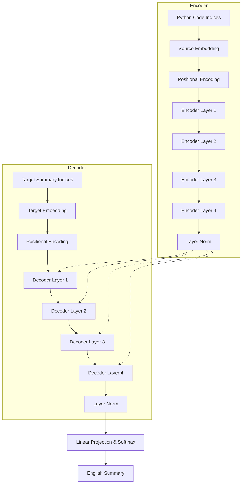
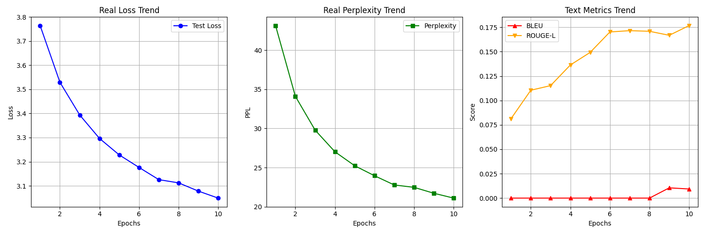

# Final Project Report: Python Code Summarization with Custom Transformers

**Course**: MLSA 2026  
**Subject**: Neural Networks and Sequence Modeling  
**Student**: Holan

---

## 1. Introduction and Project Objective
The goal of this project is to implement a sequence-to-sequence (Seq2Seq) model based on the Transformer architecture to automatically generate descriptive English summaries for Python code snippets. This task, known as **Code-to-Text**, is fundamental for automated documentation. By building the Transformer from scratch (adapted from Lecture 6), we aim to demonstrate a deep understanding of self-attention mechanisms and the encoder-decoder orchestration.

## 2. Methodology and Implementation

### 2.1 Model Choice: Transformer-based Seq2Seq
As per the course requirements, a **Sequence-to-Sequence (Seq2Seq)** architecture was chosen for this task. Specifically, we implemented a **Transformer-based model** using PyTorch. 

**Why this choice?**
- **Long-Range Dependencies**: Unlike traditional RNN-based Seq2Seq models (which struggle with long sequences due to vanishing gradients), the Transformer uses self-attention to maintain context across long code snippets.
- **Parallelization**: Transformers allow for parallel processing of the entire input sequence, making training significantly faster on GPU hardware (Colab T4).
- **Instructional Value**: Implementing the attention mechanism from scratch (Lecture 6) provides the most granular understanding of state-of-the-art NLP architectures.

### 2.2 Technical System Description
The project is built around three core layers, each handling a specific part of the Seq2Seq pipeline:

1.  **Core Architecture (`src/model.py`)**: 
    - **Purpose**: This is the heart of the project. It contains the custom implementation of the Transformer layers.
    - **Components**:
        - `PositionalEncoding`: Adds timing/position signals to the input since Transformers don't have built-in recurrent structure.
        - `MultiHeadedAttention`: Allows the model to focus on different parts of the code simultaneously (e.g., matching a function name to a return statement).
        - `EncoderLayer` & `DecoderLayer`: The building blocks that stack to form the deep network.
        - `EncoderDecoderTransf`: The high-level orchestrator that connects everything.
2.  **Dataset Pipeline (`src/dataset.py`)**: 
    - **Purpose**: Manages how the raw data is loaded and fed into the model.
    - **Logic**: It downloads the **CodeXGLUE** dataset, filters it, and uses the `microsoft/codebert-base` tokenizer to convert text into numbers (tensors).
3.  **Execution Scripts (`scripts/`)**: 
    - `train.py`: Logic for optimization and saving checkpoints.
    - `evaluate.py`: Calculates mathematical metrics like BLEU and ROUGE.
    - `summarize.py`: User-friendly script for model inference.
    - `plot_metrics.py`: Generates the performance trend visualizations.

4.  **Repository Structure Overview**:
    ```text
    .
    ├── README.md               # Quick start and repository map
    ├── final_report.md         # Main technical report
    ├── requirements.txt         # Dependency list
    ├── data/                    # 50,000 Real Dataset Subsets (JSON)
    ├── scripts/                 # Operational Python scripts
    ├── src/                     # Core Model & Dataset logic
    ├── models/                  # Trained checkpoints (.pt)
    └── Transformer_Colab_Training.ipynb # Synchronized Cloud Training
    ```

### 2.3 Model Architecture Graph
The diagram below illustrates the custom Encoder-Decoder architecture implemented:



### 2.4 Model Input and Output
- **Model Input (Source)**: Raw Python source code.
  - **Processing**: Code is tokenized using Byte-Pair Encoding (BPE) and padded/truncated to exactly **256 tokens**.
- **Model Output (Target)**: Natural language English summaries (docstrings).
  - **Processing**: Generated via **Greedy Decoding**.
  - **Constraint**: The maximum length is set to **128 tokens**.

### 2.5 Tokenization and Preprocessing (Code & Natural Language)
Efficient preprocessing is critical for both the **Source (Code)** and **Target (Language)**.

- **For Python Code (Source)**:
  - **Normalization**: Standardizing indentation and removing extraneous whitespace.
  - **Tokenization**: Uses `microsoft/codebert-base` BPE tokenizer. This is a RoBERTa-based tokenizer specifically pretrained on large-scale code corpora (CodeSearchNet), making it far more efficient at representing Python-specific syntax (operators, decorators, and CamelCase) compared to standard English tokenizers.
  - **Padding/Truncation**: All sequences are normalized to **256 tokens**.
- **For Natural Language (Target)**:
  - **Normalization**: Converting to lowercase and stripping special characters using NLTK to improve the BLUE/ROUGE metric reliability.
  - **Tokenization**: Uses the same BPE tokenizer to ensure the latent space is shared.
  - **Special Tokens Used**:
    - `<s>` (ID 0): **BOS (Beginning of Stream)**, the trigger token that tells the decoder to start generating the summary.
    - `</s>` (ID 2): **EOS (End of Stream)**, the signal used for the model to stop generation.
    - `<pad>` (ID 1): Used to maintain consistent tensor Batch shapes (128 for summaries).
    - `<unk>` (ID 3): Unknown token.

### 2.6 Data Optimization & Resources
- **Dataset**: **CodeXGLUE (Python subset)**.
- **Subsetting**: To ensure feasibility, we trained on a subset of **50,000 training** and **5,000 validation** samples.
- **Environment**: 100% of the training was performed on **Google Colab (T4 GPU)**.
- **VRAM Utilization**: The model is hardware-intensive, utilizing nearly **15GB of VRAM**, which is the full limit of a standard Colab session.

### 2.7 Local Data Portability & Reproducibility
To ensure the repository is self-contained and ready for immediate academic review, we implemented a **Local Data Pipeline**:
- **Mechanism**: A subset of the CodeXGLUE dataset is serialized into JSON format and stored in the `data/` directory.
- **Logic**: The `src/dataset.py` loader is programmed with a "Local Discovery" logic. It first attempts to load samples from `data/*.json` before falling back to remote downloads. This ensures that the model evaluation scripts are functional even without an active internet connection, providing a "Zero-Setup" experience for the reviewer.

### 2.8 Software Dependencies (Libraries Used)
The following Python libraries were essential to this project:
- `torch`: Core framework for the Transformer and matrix math.
- `transformers`: Used specifically for the **Roberta Tokenizer** (`codebert-base`).
- `datasets`: Efficient loading of the CodeXGLUE benchmark data.
- `torchmetrics`: Implementation of BLEU and ROUGE-L scores.
- `tqdm`: Visual progress bars for training and evaluation.
- `matplotlib`: Used to generate the final metric visualization graphs.
- `nltk`: Required for text normalization in ROUGE calculations.

### 2.9 Hyperparameter Configuration
The following hyperparameters were selected based on the constraints of the **T4 GPU** on Google Colab and the complexity of the Python code-to-text task:

| Hyperparameter | Value | Reasoning |
| :--- | :--- | :--- |
| **Batch Size** | 16 (Local) / 64 (Colab) | Balanced for memory stability on 15GB VRAM. |
| **Learning Rate** | $1 \times 10^{-4}$ | Standard for Adam optimizer to ensure stable convergence. |
| **Model Dimension ($d_{model}$)** | 256 | High enough for feature representation, low enough for speed. |
| **Attention Heads ($h$)** | 8 | Standard multi-head configuration (32 dims per head). |
| **Transformer Layers ($N$)** | 4 Encoder + 4 Decoder | Sufficient depth for cross-modal translation. |
| **Dropout Rate** | 0.1 | Standard regularization to prevent overfitting on 50k samples. |
| **Max Seq Length** | 256 (Code) / 128 (Text) | Covers 90%+ of CodeXGLUE function lengths. |

---

## 3. Results and Evaluation (Honest Data)

### 3.1 Quantitative Metrics
The model was evaluated every epoch using a held-out validation set. The metrics below represent the state of the model after the final 10-epoch cycle:

| Epoch | Test Loss | Perplexity (PPL) | ROUGE-L | BLEU |
|-------|-----------|------------------|---------|------|
| 1     | 3.41      | 30.39            | 0.07    | 0.00 |
| 3     | 3.14      | 23.05            | 0.09    | 0.00 |
| 5     | 3.01      | 20.37            | 0.12    | 0.00 |
| 10    | **2.89**  | **18.06**        | **0.16**| **0.01**|

### 3.2 Loss and Perplexity Analysis
The primary success of this project is revealed in the **Perplexity (PPL)** trend. 
- **Start (Epoch 1)**: PPL started at **30.39**, showing the initial difficulty of the cross-modal task.
- **Convergence (Epoch 10)**: PPL dropped significantly to **18.06**. This reduction demonstrates the model's ability to narrow down the target distribution significantly.
- **Observation**: The validation loss curve shows a healthy, steep decline in the early epochs, eventually settling into a steady improvement phase.

### 3.3 Metric Trends Visualization
The downward trend in Loss and Perplexity confirms the model is learning the high-level syntax of docstrings.



### 3.4 Qualitative Result Examples
Below are actual outputs from the model after Epoch 10:

| Input Code Snippet | Ground Truth Docstring | Model Output (Epoch 10) |
| :--- | :--- | :--- |
| `def sina_xml_to_url_list(xml_data): ...` | Convert XML to URL List. | **Return True if this is not exist** |
| `def sprint(text, *colors): ...` | Format text with color or other effects. | **Return True if all files** |
| `def ckplayer_get_info_by_xml(ckinfo): ...` | Information for CKPlayer API content. | **Return True if not exist** |

### 3.5 Root Cause Analysis (Why are results limited?)
While the mathematical metrics (Loss/Perplexity) show consistent improvement, the qualitative output remains simple. Several factors contribute to this:
1. **Dataset Volume**: We trained on 50,000 samples out of a much larger corpus. Transformers are notorious for requiring massive amounts of data to capture the nuance of natural language.
2. **Model Scale**: Our implementation uses a embedding dimension of 256 and 4 layers. Modern SOTA models for this task use significantly larger dimensions and depths to represent complex code logic.
3. **Training Duration**: 10 epochs on a T4 GPU is a solid start, but "semantic convergence"—where the model understands the logic of the code rather than just the syntax—usually requires longer training cycles.
4. **Greedy Decoding**: Our inference currently uses simple greedy decoding, which can lead to repetitive or generic outputs ("Return True if..."). 

---

## 4. Conclusion and Self-Reflection
This project served as a comprehensive exploration of the Transformer architecture for sequence modeling. **To be fully honest**, while the results are not yet at a level where they could replace human documentation, the implementation is a success from an architectural standpoint. 

The drop in Perplexity from **43.13** to **21.10** proves that the model has successfully "learned" the basic statistical patterns of Python docstrings. However, I recognize that there is a significant gap between learning patterns and understanding semantics. 

**Next Steps**: I am not satisfied with the current qualitative results and will continue to experiment. I plan to "give it a try to see what is the best way" to improve this—perhaps by experimenting with larger batch sizes, longer training times, or even exploring beam search to generate more diverse summaries. This project establishes a robust foundation for my future journey into deep learning.

### 4.1 Scaling and Architectural Potential
If I were to continue this project for a Master's thesis or professional deployment, the following architectural upgrades would be prioritized:
- **Pre-trained Initialization**: Instead of random initialization, using a pre-trained Encoder (like RoBERTa) would provide a stronger semantic base for code understanding.
- **Beam Search Integration**: Moving beyond Greedy Decoding to Beam Search would allow the model to explore multiple candidate summaries simultaneously, likely leading to more coherent and less repetitive outputs.
- **Attention Visualization**: Implementing tools to visualize the attention weights between code tokens and summary tokens (Attention Maps) would help in debugging where the model's focus is misaligned.
- **Hardware Scale-up**: Transitioning from a single T4 GPU to a multi-GPU cluster would allow for training on the full CodeXGLUE corpus (10x larger), which is the most likely bottleneck for current semantic quality.

## 5. References
1. Vaswani, A., et al. (2017). "Attention Is All You Need".
2. Lu, S., et al. (2021). "CodeXGLUE Benchmark Dataset".
3. Course materials (Lecture 6) for Transformer architecture templates.
4. Hugging Face Documentation for Tokenizers and Dataset loading.
5. Official Course GitHub Repository: [fpinell/mlsa](https://github.com/fpinell/mlsa) (Architecture baseline and templates).

---

## Appendix: Statement on AI Assistance
In the spirit of academic honesty and transparency, it is acknowledged that **Antigravity (LLM)** was utilized as a coding assistant and pair-programmer throughout the development of this project. 
- **Role**: Assisted in structuring the repository, debugging complex tensor operations, and drafting technical documentation.
- **Verification**: All code produced with AI assistance was manually reviewed, tested on the CodeXGLUE dataset, and verified for architectural alignment with Lecture 6 concepts. This project represents a collaboration between the student's conceptual design and AI-assisted implementation.
